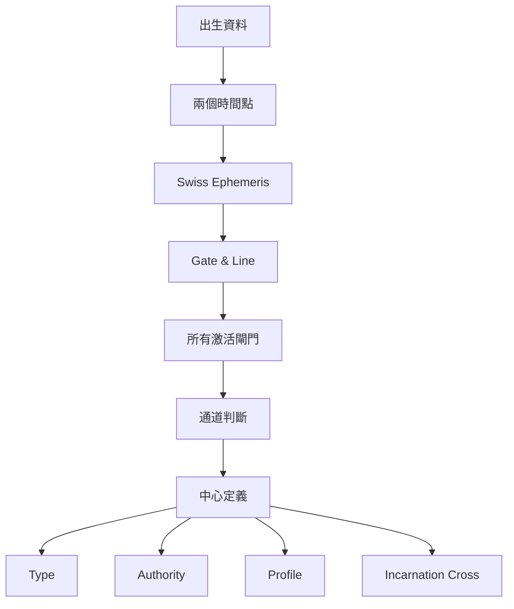

Read AGENTS.md first and follow it strictly.
# 10 人類圖計算完整流程圖

```mermaid
flowchart TD
    A[出生資料] --> B[兩個時間點]
    B --> C[Swiss Ephemeris]
    C --> D[Gate & Line]
    D --> E[所有激活閘門]
    E --> F[通道判斷]
    F --> G[中心定義]
    G --> H1[Type]
    G --> H2[Authority]
    G --> H3[Profile]
    G --> H4[Incarnation Cross]
```
